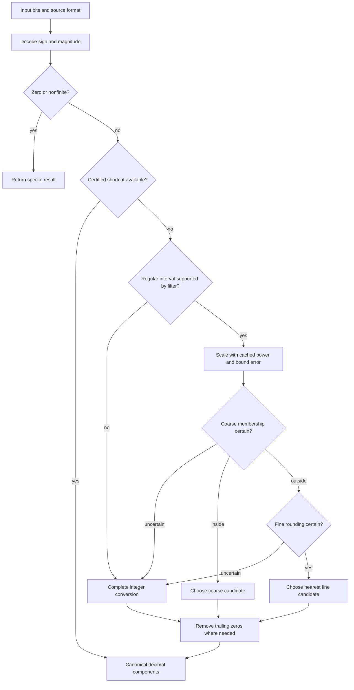

# Boundragon: algorithm, foundations, and contributions

Boundragon converts an IEEE 754 binary32 or binary64 value into a shortest
decimal coefficient and exponent. Its focus is to **certify decimal decisions
with less precision**, using centered error bounds and format-specific integer
arithmetic. A complete integer converter resolves uncertain cases.

The main Boundragon algorithm was invented by **GPT-6 Astra and GPT-6.1 Sol**
during development with [akeit0](https://github.com/akeit0). This attribution
covers the centered decision guards and their error-bound design. The decimal
grid geometry, scaling, and complete finishing techniques retain the prior-art
credits described below.

## What is new, in plain language

**This repo adds a cheap way to prove that an approximate calculation has
chosen the right decimal.** It calculates with fewer bits, tracks how much
information was left out, and accepts the result only when that uncertainty
cannot change the answer. Difficult cases use the complete converter.

The main additions are:

- **Put the estimate in the middle of its possible error range.** If the true
  value is somewhere between an estimate and that estimate plus two units,
  moving the reference point up by one leaves only one unit of uncertainty
  on either side. This makes the test for a valid shorter decimal tighter.
- **Check the choice directly.** One test establishes whether the shorter
  decimal is valid. If it is not, another establishes that rounding the longer
  decimal cannot change or land on a tie. The converter can then return the
  coefficient without generating a digit buffer first.
- **Let smaller tables omit information safely.** The tables need enough
  precision to prove these choices. Each compressed table comes with a bound
  on what it omitted, so the same decision tests can use different table sizes.
- **Use the available precision differently for each format.** The binary32
  path fits its smaller input coefficient and a more precise scale into one
  64-bit product. Both formats keep independently checked error bounds and a
  complete fallback for uncertainty.

Approximation with fallback was established by Grisu3; the decimal scaling and
exact finishing logic here come from xjb/zmij. The repo-specific contribution
is how the centered tests, table error bounds, and format-specific arithmetic
work together. [Section 9](#9-contributions-novelty-and-correctness-scope)
derives these mechanisms and explains their novelty scope.

[The proof](proof.md) supplies the detailed binary64 argument, and the
[source map](#10-source-map-and-further-reading) connects it to the implementation.

## 1. The conversion problem

For a finite input, the public `to_decimal` API returns `Decimal{sig, exp,
negative}`, representing the exact decimal value

$$
(-1)^{\mathrm{negative}}\;\mathrm{sig}\;10^{\mathrm{exp}}.
$$

It selects the result in this order:

1. The decimal must round back to the original **source format** under
   round-to-nearest, ties-to-even parsing.
2. Its canonical integer coefficient must have the fewest significant digits.
3. Among equally short decimals, choose the one closest to the exact input.
4. If that choice is an exact decimal tie, choose the even coefficient.

Canonical means that a nonzero coefficient has no trailing decimal zeros:
`1000 * 10^-4` becomes `1 * 10^-1`. The lower-level `components_raw` and
`components_raw32` APIs can retain those zeros; their numerical result has the
same selection policy after normalization.

“Shortest” concerns significant digits, rather than the length of a particular
printed string. For example, choosing between `0.0001` and `1e-4` is a later
formatting decision. This repository's public converter returns components;
it does not write ASCII or implement a requested number of fixed decimal places.

The sign is handled separately from the magnitude. Zero preserves its sign.
Infinity and NaN use `exp == 10000`: `sig == 0` denotes infinity, while a nonzero
`sig` carries the original NaN fraction bits. The finite-decimal policy does
not apply to these sentinel results.

Source precision matters. A `float` has a wider rounding interval than the
exactly equal value obtained by promoting it to `double`. For example,
binary32 `0.1f` can return `(1, -1)`, while that promoted value's shortest
binary64 decimal is `0.10000000149011612`. The native binary32 kernel solves
the binary32 problem directly.

## 2. Overall structure



Shortcut and dispatch details depend on the format and cache policy. The
mathematical responsibilities remain the same: establish a valid rounding
interval, select the shortest and closest decimal in it, and canonicalize the
components. A filter rejection means that its approximation is insufficient;
the complete converter still produces an answer.

Conversion uses fixed-width integer arithmetic after reading the input bits.
The binary64 implementation uses `__uint128_t` for wide products. The standalone
binary32 header needs at most 64-bit arithmetic. Neither kernel performs
floating-point arithmetic to calculate its decimal answer.

## 3. Rounding intervals and the two-grid reduction

### 3.1 Decode the binary value

Write the positive magnitude as

$$
x=m2^q.
$$

For normal binary64 inputs, `m` is a 53-bit integer including the implicit
leading bit, and `q = raw_exponent - 1075`. Subnormals have `q = -1074` and use
their stored fraction as `m`. For binary32, the corresponding formulas are a
24-bit normal significand and `q = max(raw_exponent, 1) - 150`.

A regular input has the rounding interval

$$
\mathcal I_x = [(m-\tfrac12)2^q,\;(m+\tfrac12)2^q].
$$

Both endpoints are included when `m` is even and excluded when it is odd.
Those choices encode the parser's binary ties-to-even rule. The interval's
radius is $r=2^{q-1}$.

Normal powers of two above the minimum normal have a closer predecessor:
their lower endpoint is $(m-\tfrac14)2^q$, while their upper endpoint remains
$(m+\tfrac12)2^q$. They need an asymmetric treatment. The minimum normal is
regular because subnormals and that first normal share the same spacing.

### 3.2 Choose the grids from binary spacing

For a regular interval, define

$$
k=\lfloor\log_{10}(2^q)\rfloor,\qquad
\Delta=10^k,\qquad g=10^{k+1}=10\Delta.
$$

The **fine grid** consists of integer multiples of $\Delta$; the **coarse grid**
consists of integer multiples of $g$. Their spacing brackets the binary spacing:

$$
\Delta\le 2^q<g.
$$

These logarithmic floors describe exact mathematical quantities. The runtime
computes them with certified integer multiply-and-shift formulas and reads
cached powers; it does not evaluate floating-point logarithms or powers.

The explorer uses different exponent names in its two native paths:

| Geometric role | binary32 Fast | binary64 Balanced |
|---|---|---|
| Coarse spacing | $10^e$ | $10^{k+1}$ |
| Fine spacing | $10^{e-1}$ | $10^k$ |
| Retained units per coarse spacing | $Q=2^{40}$ | $2048=2^{11}$ |
| Estimated offset from coarse candidate $I$ | $r/Q$ | $w/2048$ |

Thus `e = k + 1` describes the same grid choice for the ordinary symmetric
path. The integer precision and error contracts differ, but both measure the
input, its offset, and the interval radius in one common coordinate system.
Moving to fine units multiplies the coarse coefficient and offset by ten;
it does not change the input or its rounding interval.

This gives two useful facts:

- The interval is narrower than one coarse step, so it contains at most one
  coarse-grid point.
- The nearest fine-grid point is within $\Delta/2\le r$ of the input and is
  valid. The equality case does not introduce an open-endpoint problem:
  equal binary and decimal spacing here occurs at `q = k = 0`, where the input
  itself is a grid point.

The conversion therefore asks whether the nearest coarse point is valid. If
it is, choose it and remove decimal zeros. If no coarse point is valid, choose
the nearest fine point, applying decimal ties-to-even if necessary.

This is a direct candidate calculation. It does not generate an arbitrary
number of digits and then repeatedly discard them.

### 3.3 Why this means shortest, and then closest

Every decimal grid coarser than $g$ is a subset of the coarse grid. When its
unique valid point has trailing zeros, removing them finds the coarsest grid
containing that same value. If no coarse point is valid, a valid fine point
cannot have a trailing zero: such a zero would make it a coarse point too.

Relating the coarsest grid to the fewest significant digits also requires
checking decimal decade boundaries. Within one decade, a larger canonical
exponent means fewer digits. Across a power of ten, equal-length candidates
can have different exponents, so coarse uniqueness alone is insufficient.

The [two-grid proof](proof.md#2-why-these-two-decimal-grids-give-shortest-and-closest-output)
handles this explicitly. If no coarse point exists, the relevant interval
cannot cross a decimal decade boundary. If a valid coarse point is a power
of ten, the interval is narrow enough for `m >= 11` to make it the closest
one-digit candidate too. The first ten positive subnormals are checked
separately against exact rational intervals.

For example, the second positive binary64 subnormal admits both `9e-324` and
`1e-323`, each with one significant digit. `1e-323` is closer. Counting only
the digits of the unnormalized coefficients would give the wrong policy.

### 3.4 Worked examples

For binary64 `0.1`,

$$
m=7205759403792794,\quad q=-56,\quad
k=-17,\quad g=10^{-16}.
$$

The coarse candidate is $10^{15}g=0.1$. Its distance from the actual binary
value is below $2^{-57}$, so it lies in the rounding interval. Normalizing
`(1000000000000000, -16)` yields `(1, -1)`.

For binary32 bits `0x3f800001`, the value immediately above `1.0f`,

$$
x=8388609\,2^{-23}=1.00000011920928955078125.
$$

Here `k = -7` and `g = 10^-6`. Neither adjacent coarse point, `1.0` or
`1.000001`, is valid. The nearest fine point is `1.0000001`, inside the open
interval $(1+2^{-24},\;1+3\,2^{-24})$. The result is `(10000001, -7)`;
its final digit already proves that no normalization is needed.

## 4. Binary64: proving decisions from an approximation

### 4.1 Scaled coordinates and the cache contract

Set

$$
P=10^{-k-1},\qquad z=xP,\qquad \alpha=2^qP.
$$

Coarse points are now integers, fine points are tenths, and the interval radius
is $\alpha/2$, with $0.1\le\alpha<1$. The public binary64 filters use the
fixed-point unit $K=2048=2^{11}$:

$$
Y=Kz,\qquad R=K\alpha/2.
$$

Each cache policy supplies an integer center approximation `u`, an even error
bound `B`, and an exact integer radius floor `h`, satisfying

$$
0\le Y-u<B,\qquad h=\lfloor R\rfloor.
$$

These are contracts with the **exact real scaled input**, including cached-power
truncation. Comparing two approximations to each other would not be enough.

Let `c = B/2` and center the uncertainty at `v = u+c`:

$$
-c\le Y-v<c.
$$

Choose the coarse integer `j` nearest to `v/K`, and let `w = v-K*j` be the
signed residual, with $-K/2\le w<K/2$. A quotient and a mask obtain `j` and
`w`; no integer division is needed because `K` is a power of two.

### 4.2 The coarse decision guard

With `D = abs(w)`, the decision is:

| Observed distance | Proven conclusion |
| --- | --- |
| `D <= h-c` | The selected coarse point is valid. |
| `D >= h+c+1` | Every coarse point is outside the interval. |
| `-c+1 <= D-h <= c` | The approximation is ambiguous; use the complete converter. |

The last row becomes the single unsigned comparison

```cpp
unsigned(D - h + c - 1) < 2 * c
```

For Fast and Balanced, `c = 1`, so only `D == h` and `D == h+1` are ambiguous.
The distance-to-nearest-grid function is 1-Lipschitz: moving the center by at
most `c` changes that distance by at most `c`. This establishes the outside
decision even if the identity of the nearest point changes.

The inside decision needs an additional endpoint lemma. If `R` is not an
integer, a distance at most `h` is strictly smaller than `R`. If `R` is an
integer, coincidence of a coarse point and an endpoint would require

$$
Kj=Y\pm R=(2m\pm1)R.
$$

Since `K` is a power of two and `2m±1` is odd, this would require `K` to divide
`R`, which is impossible for $0<R<K/2$. Thus the accepted point is strictly
inside, including for inputs whose binary interval has open endpoints.

### 4.3 The fine rounding guard

If every coarse point is outside, the fine coefficient is the nearest integer
to `10*z`. In centered coordinates, calculate

$$
t=5w+K/4,\qquad M=K/2.
$$

The unknown correction is $5(Y-v)\in[-5c,5c)$. Reject when

```cpp
((unsigned(t + 5*c) & (M - 1)) <= 10*c)
```

Otherwise `t mod M` lies sufficiently far from both ends of a rounding cell
that the correction cannot change `floor(t/M)` or produce an exact halfway
tie. The answer is

$$
\mathrm{sig}=10j+\lfloor t/M\rfloor,\qquad \mathrm{exp}=k.
$$

The signed increment may be negative. Accepted fine results have a nonzero
last decimal digit. Coarse results can instead be formed as `(j, k+1)` and
normalized. Exact ties and uncertain boundary cases go to the complete path,
where parity is handled explicitly.

### 4.4 Why one high-limb product is enough

Normalize the decimal power to 128 bits:

$$
E=\lfloor\log_2 P\rfloor,\qquad
C=\lfloor P2^{127-E}\rfloor=H2^{64}+L.
$$

Write $P=(C+\epsilon)2^{E-127}$, where $0\le\epsilon<1$. With
`s = q+E+12` and `n = m*2^s`,

$$
Y=\frac{nH}{2^{64}}+\frac{n(L+\epsilon)}{2^{128}}.
$$

The certificates establish `8 <= s <= 11` and `n < 2^64`. Consequently

$$
u=\left\lfloor\frac{nH}{2^{64}}\right\rfloor
\quad\Longrightarrow\quad 0\le Y-u<2.
$$

One unit accounts for truncating the high-limb product; another bounds the
omitted low limb and power remainder. The radius is available by a shift:

$$
h=H\mathbin{\texttt{>>}}(65-s).
$$

This is its exact floor, despite using only `H`. The discarded fraction is
smaller than one and cannot cross the integer division threshold. Smaller
cache policies establish analogous contracts by bounding reconstruction error.

## 5. Caches as part of the algorithm

The binary64 power range is `-293..324`, or 618 normalized powers. The filters
need a bounded high-limb approximation, while the complete fallback needs the
exact normalized 128-bit floor. Keeping these requirements separate allows
different storage/reconstruction choices without changing the output policy.

| Binary64 policy | Power representation for filtering | `B` | Numeric cache bytes, including fallback |
| --- | --- | ---: | ---: |
| Fast | All 618 high limbs and an exponent-shift table | 2 | 7,584 |
| Balanced, the default | All high limbs; derive shifts arithmetically | 2 | 5,536 |
| Half | Store every second high limb; reconstruct neighbors with shifts and multiplication by five | 6 | 3,064 |
| Tiny | Reconstruct from stride-16 high anchors and shared small powers | 4 | 912 |
| Minimal | Reuse the fallback's stride-28 anchors and small powers | 4 | 592 |

These are numeric array payloads, excluding alignment, executable code, unwind
data and callers' formatting tables. They are not linked executable sizes.

For Half, an adjacent normalized power is its anchor multiplied by `5/4` or
`5/8`. Discarding low bits before multiplying gives a lower approximation whose
total scaled error is below six.

Tiny and Minimal first reconstruct an upper approximation `U` to the exact
normalized high real significand `T`. The generator proves
`0 <= U-floor(T) <= 2`. Using `U-2` for scaling gives `0 <= T-(U-2) < 3`,
and hence total product error below four. Their radius calculation uses `U`,
rather than `U-2`; the equality with the exact radius floor is checked for each
power and permitted shift. Phase information determines the normalization and
scaling shift. See the [cache contracts](../proof/cache_bounds.md).

For the complete fallback, 23 normalized 128-bit anchors and 28 exact normalized
64-bit small powers reconstruct the full power. Biased anchors produce a value
at most one unit above the desired floor, with an exact high limb. The
floor-sum certificate uses this actual coefficient and proves all downstream
rounding decisions without a correction bitmap. The payload is
`23*16 + 28*8 = 592` bytes.
The generator uses exact integers, rather than floating-point `pow` or logarithms.

More reconstruction saves storage but adds arithmetic and may widen the
ambiguous shell. Policy names express implementation choices; none changes the
shortest/closest contract or establishes a universal performance ranking.

## 6. The complete integer fallback

“Exact” describes the **certified decimal decisions**, rather than an exact
evaluation of every intermediate real number. The fallback also uses finite
cached powers and truncated products. Their precision, endpoint adjustments,
and tie corrections are sufficient to reproduce the exact interval decisions
over the supported domain.

For a regular binary64 input, use `C` for the certified reconstructed coefficient,
choose
`s0 = q+E+10`, and obtains

$$
F=\left\lfloor\frac{C\,m2^{s_0}}{2^{73}}\right\rfloor,
\qquad Q=2^{64}.
$$

Here `Q` is the fallback's unit, distinct from the filter's `K`. The integral
part `F/Q` and the fractional word `f = F mod Q` locate the value between coarse
points. Two wide products retain the high limb and the relevant contribution
of the low limb.

The radius word includes `1-(m&1)`, encoding the different open/closed binary
endpoints. Addition carry and subtraction comparisons decide whether the
upper or lower coarse point is valid. If neither is valid, a multiply by ten
selects the fine digit. The inherited regular formula uses a `+6` correction
after truncation; it is justified by exact threshold equalities, rather than
by assuming that a loose error bound preserves rounding. An exact quarter
detector corrects the `2.5` case to even; `7.5` already rounds upward to even.

Asymmetric normal powers of two use a separate lower-radius calculation and
clamp the fine candidate to the valid interval. Subnormals retain their true
source spacing. Small-subnormal and power-of-two outputs receive independent
rational checks. Zero and nonfinite cases are dispatched before scaling.

The runtime fallback uses fixed-size arithmetic and static tables, with no
bignum allocation. The exact finishing logic is adapted from zmij, with its
license attribution retained in [NOTICE.md](../NOTICE.md).

## 7. Binary32 and canonical output

Binary32 uses the same interval geometry and two-grid argument, with narrower
integer operands and its own cached powers. It has two filter designs:

| Design | Approximation | Complete fallback | Numeric payload |
| --- | --- | --- | ---: |
| Compact | Centered high-32-bit product, `K = 256`, `B = 2` | 77 normalized 64-bit powers; two 32-by-32 products | 616 bytes |
| Fast / Integers | Direct fixed-point scaling with `Q = 2^40` | Same 64-bit-power fallback | 3,676 bytes |

`FloatPolicy::Fast` is the default. `FloatPolicy::Integers` uses the same
filter and tables, with broader exact-integer dispatch. These policies are
separate from the binary64 `Cache` policies. `components_raw32` uses the Compact
kernel, while the default canonical API uses Fast.

### 7.1 Direct binary32 fixed-point filtering

With the same $\alpha=2^q/10^{k+1}$ as before, cache

$$
W=\lfloor\alpha Q\rfloor,\qquad Q=2^{40}.
$$

For the 24-bit input significand, the exact center obeys
$Qz=mW+\delta$, where $0\le\delta<m$. Compute

$$
I=\left\lfloor\frac{mW+Q/2}{Q}\right\rfloor,\qquad
r=(mW+Q/2)\bmod Q-Q/2,\qquad h=\lfloor W/2\rfloor.
$$

The true residual is `r+delta`; the true radius lies in `[h, h+1)`. Thus:

- `abs(r)+m+1 < h` certifies the coarse candidate.
- `abs(r) > h+m+1` certifies that it is outside.
- Otherwise, use the complete converter.

An exponent certificate also excludes the other coarse point even when the
center's uncertainty straddles a half-grid boundary. For a fine result, the
kernel checks that `floor((10*r+Q/2)/Q)` remains unchanged at `r+m`, and rejects
an exact lower halfway threshold. These tests prove both rounding stability
and absence of a tie. The resulting coefficient is `10*I + tail` at exponent
`k`; its final digit is nonzero.

All products, including the half-unit bias, fit in `uint64_t`. The parameter
table is indexed by the binary exponent and packs the scale and decimal
exponents. Normal powers of two have independently certified canonical lookup
entries. Nonzero subnormals with `m >= 11` can use the same regular filter;
the first ten go to the complete converter.

### 7.2 Normalization and shortcuts

Canonicalization preserves the decimal value while deleting trailing zeros.
Fine-grid acceptance already establishes a nonzero last digit. Coarse output
can be normalized from its shorter coefficient without first inserting a zero.

The implementation supports both serial division and bounded groups of decimal
zeros. Group removal uses a modular inverse of a power of five, a rotation to
account for the corresponding power of two, and a bound check that proves the
candidate is the exact quotient. Coefficient bounds limit the groups needed:
binary32 coarse coefficients use groups of four, two and one.

Exact integers and powers of two have specialized paths where the selected
policy supports them. The integer path checks binary fraction bits before
returning the exact integer and normalizing its decimal zeros. These shortcuts
preserve the same selection policy; they are consequences of known input
structure, rather than additional definitions of shortest output.

### 7.3 When the complete finish is needed

Error bounds certify each accepted approximation for the current input.
An uncertain boundary, changing fine digit, or unresolved tie routes to the
complete integer finish. The guard outcome is deterministic; sampled branch
frequencies are unnecessary to establish correctness. The [explorer](index.html)
shows the evaluated predicates and their consequences for each input.

## 8. Related work and algorithmic lineage

The following comparison concerns algorithm structure. Its references are
papers and the authors' reference implementations, consulted on 2026-09-30.

| Work | Established technique | Relationship to boundragon |
| --- | --- | --- |
| Dragon-family exact conversion; Burger and Dybvig (1996) | Exact boundary arithmetic and shortest, correctly rounded decimal selection. | The underlying interval problem and correctness objectives precede this repository. See [Burger and Dybvig's paper](https://legacy.cs.indiana.edu/~dyb/pubs/FP-Printing-PLDI96.pdf). |
| Grisu3; Florian Loitsch (2010) | Limited-precision conversion that certifies shortest/closest output and rejects uncertain cases. | Closest architectural precedent for approximate/certify/fallback. The double-conversion implementation generates digits and weeds uncertain candidates; its wrapper falls back to bignum conversion. See [the paper](https://www.cs.tufts.edu/~nr/cs257/archive/florian-loitsch/printf.pdf), [fast conversion](https://github.com/google/double-conversion/blob/master/double-conversion/fast-dtoa.cc), and [the wrapper](https://github.com/google/double-conversion/blob/master/double-conversion/double-to-string.cc). |
| Ryū; Ulf Adams (2018) | Complete conversion with fixed-size integer scaling of the value and boundaries, followed by decimal digit removal and exact rounding logic. | Establishes that completeness need not require a bignum runtime. boundragon uses direct two-grid selection and an explicit ambiguity fallback instead. See [Ryū](https://github.com/ulfjack/ryu) and [the binary64 core](https://github.com/ulfjack/ryu/blob/master/ryu/d2s.c). |
| Schubfach; Raffaello Giulietti (2017–2018), and Dragonbox; Junekey Jeon | Direct interval-based candidate selection; Dragonbox develops Schubfach with rounding and cache policies. | The direct-selection lineage underlying xjb/zmij. A two-grid reduction, shortest/closest component API, and compressed powers alone are not new claims. See [Dragonbox's account and paper](https://github.com/jk-jeon/dragonbox#comprehensive-explanation-of-the-algorithm), which links Giulietti's original work. |
| xjb; Xiang JunBo | Scale by `10^(-k-1)` and select a coarse or fine decimal directly. | This repository credits xjb for its decimal scaling. See [the author's algorithm pseudocode](https://github.com/xjb714/xjb#5-algorithm-principle). |
| zmij; Victor Zverovich and contributors | Fixed-size conversion and exact coarse/fine finishing, with source-format-specific rounding behavior. | Direct implementation ancestor of the fallback and finishing expressions, rather than merely a benchmark competitor. See [zmij](https://github.com/vitaut/zmij), its [source](https://github.com/vitaut/zmij/blob/main/zmij.cc), and this repo's [attribution](../NOTICE.md). |

Normalized power reconstruction is also inherited knowledge: this repository
credits Dougall Johnson for the reconstruction approach. The local exact
anchor/minor construction and corrections are visible in
[the table generator](../tools/generate_decimal_tables.py); that provenance is
recorded in [NOTICE.md](../NOTICE.md). The centered small-cache filters reuse
this structure with explicitly bounded approximations.

Structurally, boundragon differs from Grisu3's digit-generation loop by
forming the coarse/fine coefficient directly. It differs from a complete
Schubfach/Dragonbox/zmij-style primary kernel by spending less precision on an
ordinary decision and certifying that reduced calculation before accepting it.
On ambiguity, it invokes a complete fixed-size converter. These distinctions
explain the design without implying a performance result.

## 9. Contributions, novelty, and correctness scope

### 9.1 What this repository contributes

The contribution is a particular way to connect approximate arithmetic to
direct decimal selection. The following separates the foundations from the
mechanisms developed here.

| Foundation already available | Specific mechanism in this repository | What it enables |
| --- | --- | --- |
| A limited-precision converter can certify an answer and fall back on uncertainty. | Certify coarse membership and fine rounding directly from a center approximation and an exact radius floor. | Spend precision on the two decisions needed to select components, without generating and weeding a digit buffer. |
| xjb/zmij scaling reduces selection to coarse and fine candidates. | Center the one-sided product error and use a small distance shell plus a modular rounding guard. | Accept reduced-precision decisions while retaining the inherited complete selection policy. |
| Normalized powers can be reconstructed from anchors and minor powers. | Give reconstructed high approximations explicit `B` bounds and certify the radius with the appropriate operand. | Share one decision filter across full, paired, and reconstructed caches. |
| Binary32 has a smaller significand than binary64. | Allocate a direct 40-bit fixed-point scale to its 24-bit significand and certify decisions over the remaining error interval. | Use a single 64-bit product and a fixed shift for ordinary conversion. |
| Exact rational arithmetic can validate conversion rules. | Connect emitted C++ tables and expressions to exponent-class and all-significand certificates. | Check the particular compiled implementation's arithmetic contracts and exact fallback thresholds. |

The details below describe the mechanisms and their proof obligations. They
also distinguish an algorithmic contribution from a source-level arithmetic
simplification or a workload-specific shortcut.

### 9.2 Centering makes the error budget useful to both decisions

The high-limb product deliberately underestimates the scaled value:
`Y in [u, u+B)`. A uniform distance bound around `u` must allow movement by
almost `B`, even though the movement has only one direction. Choosing
`v = u+B/2` gives a balanced interval of half that radius:

$$
Y\in[u,u+B)=[v-c,v+c),\qquad c=B/2.
$$

No extra precision is calculated. The change is an integer bias and a
different reference point for candidate selection. Both coarse distance and
fine rounding then use the same signed residual `w` around the nearest coarse
point.

Compare the uniform distance guards before and after that change. Let `D0`
be distance from `u` to its nearest coarse point and `D` distance from `v`
to its nearest coarse point:

| Formulation | Ambiguous distance offsets | Number of integer offsets |
| --- | --- | ---: |
| Uncentered, using the full `B` distance bound | `-B+1 <= D0-h <= B` | `2B` |
| Centered, using `c = B/2` | `-c+1 <= D-h <= c` | `B` |

For the delivered `B = 2, 4, 6` contracts, this changes shell widths from
`4, 8, 12` offsets to `2, 4, 6`. The coordinates and nearest candidate may
also change, so this is a geometric guard-width comparison, not a claim
that a measured fallback rate is exactly halved.

For illustration, take the guard state `h = 300`, `B = 2`, `c = 1`:

- `D = 299`: the true distance is at most `300`; the endpoint lemma makes
  membership strict, so the coarse candidate is accepted.
- `D = 300` or `301`: the uncertainty could change membership; fall back.
- `D = 302`: the nearest-grid distance is at least `301`, above the true
  radius `R < 301`; no coarse point is valid.

The endpoint lemma is essential to the first case. The centered error's lower
bound is closed, so simply saying “the error is less than one” would not justify
every acceptance. This repository makes the equality case explicit using the
power-of-two fixed-point unit and the odd endpoint factors `2m±1`.

The construction is reusable whenever an even `B` and an exact radius floor
are supplied. The full and compressed caches therefore differ in their error
contracts, rather than requiring separate decimal-selection algorithms.

### 9.3 One modular predicate proves rounding stability and excludes ties

After excluding the coarse grid, the converter needs the nearest fine
coefficient. The computation uses `t = 5*w + 512`, with modulus `M = 1024`.
The real rounding numerator differs by a correction in `[-5c, 5c)`.

The test

```cpp
((unsigned(t + 5*c) & 1023) <= 10*c)
```

detects a neighborhood around a rounding-cell boundary. On acceptance,
`t mod M` is in `[5c+1, M-5c-1]`. Every possible corrected numerator is
strictly between the same two consecutive multiples of `M`. Consequently:

1. The rounded fine integer is unchanged throughout the approximation error.
2. No possible exact input is on the halfway threshold.

That second conclusion removes the need for a separate quarter-point tie test
on the accepted approximate path. The inherited complete converter still
handles actual ties; the filter's job is to prove that an accepted case cannot
be one.

Using the illustrative `h = 300`, `c = 1` state, both residuals below already
exclude the coarse grid:

| Residual `w` | `t` and possible corrected interval | Guard decision |
| --- | --- | --- |
| `350` | `t = 2262`, correction gives `[2257, 2267)`, entirely in `[2048, 3072)` | Accept fine increment `2`; coefficient is `10*j+2`. |
| `307` | `t = 2047`, correction gives `[2042, 2052)`, crossing `2048` | Fall back because the rounded increment could change. |

The unsigned mask implements a wraparound neighborhood: values near the upper
edge and values near zero are both rejected by the same comparison. Signed
residuals permit a negative fine increment without separate “round upward” and
“round downward” paths.

There is also an exact arithmetic simplification. The original numerator
`10*w+1024` is always even, so dividing both numerator and power-of-two modulus
by two loses no information:

$$
\left\lfloor\frac{10w+1024}{2048}\right\rfloor
=\left\lfloor\frac{5w+512}{1024}\right\rfloor.
$$

The guard halves in the same way. This is a source-level consequence of the
centered formulation, not a new rounding theorem or a reduction in certified
precision.

In the [actual finish](../include/boundragon/detail/centered_filter.h), a
coarse mask disables the fine ambiguity test when coarse membership is already
certified and suppresses the fine increment in the returned coefficient. The
coarse and fine ambiguity predicates feed one fallback decision. That combines
the mathematical cases into a small common finish; it does not require every
compiler to emit an identical instruction sequence.

### 9.4 Compressed caches are designed for decisions, not exact hot powers

The fallback reconstructs `C` or `C+1`, certified to preserve every rounding
decision with an exact high limb. An accepted filter only needs a lower
approximation `L` to the normalized real significand
`T`, plus an error bound. This distinction is the basis of the cache design.

With `n < 2^64`, the product error separates into two terms:

$$
Y-u=
\frac{n(T-L)}{2^{64}}
+\left(\frac{nL}{2^{64}}-
\left\lfloor\frac{nL}{2^{64}}\right\rfloor\right).
$$

If `0 <= T-L < C`, the second term is below one, so
`0 <= Y-u < 1+C`. Thus the reconstruction's missing information can be
translated directly into the guard's error budget:

| Approximation used for scaling | Bound on `T-L` | Filter bound |
| --- | --- | --- |
| Exact high floor `H` | `< 1` | `B = 2` |
| Tiny/Minimal's biased reconstruction `U-2` | `< 3` | `B = 4` |
| Half's anchor or shifted-times-five neighbor | `< 5` | `B = 6` |

Minimal reuses the fallback anchors and minor powers but omits reconstructing
the exact low limb on a successful filter path. Tiny changes the anchor stride
so the index splits with shifts and masks. Half reconstructs an adjacent high
power with shifts and multiplication by five, avoiding the additional wide
reconstruction product. Each trades a different amount of stored information
and arithmetic for a known enlargement of the ambiguity region.

Three details are necessary for that trade to be sound:

1. **Preserve the direction of error.** Taking `U-2` converts a certified upper
   approximation into a lower one. Using `U` for input scaling would violate
   the shared one-sided contract.
2. **Certify the radius separately.** Tiny and Minimal compute `h` from `U`,
   while scaling from `U-2`. Half uses its own upward radius correction.
   A correct center bound alone does not prove `h = floor(R)`.
3. **Recover the exact scaling phase.** Normalization can shift by one bit.
   The exponent phase must include that shift; matching an approximate power
   numerically does not establish the correct exponent or radius shift.

For Minimal, the existing anchor phases follow `(anchor_index+1) mod 4`, and
the minor phases fit into two bits per entry in an immediate constant.
Together with the normalization bit, they recover `E mod 4` and hence
`s = 8+((q+E)&3)`. This avoids an additional exponent-shift array. The finite
phase identities and inclusive normalization thresholds are checked by the
[cache generator](../tools/generate_compact_cache.py).

The particular combination is more specific than “compressed cached powers”:
approximate only the information needed for the filter, preserve its error
direction, retain the exact radius floor, and share the complete reconstruction
for rejected decisions.

### 9.5 Binary32 allocates precision differently

Native binary32 conversion is required by the source-format contract. The
additional design choice is to exploit its 24-bit coefficient through a direct
40-bit fixed-point scale, instead of only shrinking the binary64 constants.

Write `alpha*Q = W+theta`, where `Q = 2^40` and `0 <= theta < 1`. Then

$$
Qz=mW+m\theta,\qquad 0\le m\theta<m.
$$

The cached coefficient is indexed directly by the binary exponent. One product
`m*W` produces the approximate center; the correction bound is simply the input
coefficient `m`. The fixed shift by 40 extracts the coarse candidate and residual.
No per-input normalization shift is needed on that path.

The integer-width budget explains why this is possible. Since
`m <= 2^24-1` and `W < Q`, even the half-unit-biased product satisfies

$$
mW+Q/2\le(2^{24}-1)(Q-1)+Q/2<2^{64}.
$$

In coarse-grid units, the omitted-center error is below `m/Q < 2^-16`.
For comparison, Compact's uniform high-limb bound is `2/256 = 2^-7`.
The worst-case upper bounds differ by a factor of 512; this compares error
budgets, not measured speed or fallback counts. The direct parameter table
spends additional storage to make that smaller uncertainty available with
64-bit arithmetic.

Binary32's guard retains a one-sided interval rather than reusing the small-`K`
centered predicates: it checks coarse distance over `[r, r+m)` and fine rounding
at both ends of that interval. Its separate exponent certificate proves that
the other coarse point cannot become valid. Together, these establish that
the chosen candidate and its rounding remain stable.

This is a format-specific instance of the same principle: calculate only enough
information to certify the selection, and preserve the complete converter for
uncertainty. Power lookup and integer dispatch are supplementary shortcuts;
they are not the justification for the ordinary filter.

### 9.6 Certificates cover the decisions that approximation cannot settle

The approximate filter's safety relies on a complete fallback. Merely comparing
it against the inherited implementation would not independently establish the
fallback's boundary and tie behavior. The local certificate therefore compares
its emitted expressions against exact rational selection rules.

For a fixed exponent and significand parity, write `m = m0+2*i`. Compiled
boundary expressions and exact rational boundaries become floors of affine
functions of `i`. A verifier can compare these sequences without visiting every
significand individually:

1. Subtract the underlying rational affine functions. Their difference is
   linear and can change sign at most once.
2. Split the domain at that possible crossing. On each piece, their floors
   are pointwise ordered.
3. Compute both floor sums exactly by Euclidean descent.
4. If the sums agree on a piece, every ordered integer difference is zero,
   proving equality at every significand in that piece.

The ordering step prevents positive and negative differences from canceling.
For fine rounding, the verifier compares the ten digit thresholds separately,
including the inherited `+6` correction. Congruence counts and a subset check
establish the quarter detector's exact tie coverage. Powers of two and small
subnormals are checked against independently constructed rational intervals.

The connection to source is concrete: a compiled probe emits the literal
powers, reconstructed powers, exponent/shift helpers, and exceptional outputs.
The verifier recomputes the mathematical quantities independently. This
combination supplies evidence for the actual cache and finish used by the
filter, while keeping the proof's C++/compiler assumptions explicit. The
method itself uses established floor-sum and modular arithmetic techniques;
the contribution here is their application to these conversion expressions
and the maintained source-to-formula checks.

### 9.7 Which novelty claims follow

The identifiable design contribution is the combination of centered direct
selection guards, cache representations with certified decision contracts,
native precision allocation, and implementation-linked certificates.
Guarded approximation, cached powers, interval-based shortest selection,
finite-integer completeness, and coefficient/exponent APIs all have prior art.
Decimal scaling, reconstruction, and exact finish logic have explicit upstream
attribution. Historical priority for the particular predicates is not
established by this repository's proof or by the related-work survey above.

Instruction scheduling, optional x86 assembly, integer shortcuts, lookup
dispatch, and zero-removal groups are implementation engineering around that
core. Timing results are evidence about particular implementations and inputs;
they do not establish algorithmic novelty.

### 9.8 What the correctness evidence establishes

| Evidence layer | What it checks |
| --- | --- |
| Interval and two-grid argument | Why the selected decimal is valid, shortest, closest, and correctly tie-broken, including decade-boundary exceptions. |
| Cache certificates | Literal powers, reconstruction errors, radius floors, exponent phases, table coverage, and safe product/shift bounds. |
| Fallback certificates | Equality of compiled coarse boundaries and fine thresholds to exact rational expressions over full significand ranges. |
| Independent rational oracles | Construct intervals from the source representation and search digit counts independently of cache/filter formulas. |
| Compiled cross-checks and sanitizer runs | Exercise the actual C++ paths, policies and special cases; detect disagreement and undefined behavior in the checked runs. |

The binary64 fallback certificate uses exact floor sums and congruence checks
over exponent/parity classes. It covers whole significand ranges symbolically;
it does not enumerate every binary64 value. Normal powers of two and the first
ten subnormals receive separate rational-oracle checks.

Binary32 has corresponding compiled cache/fallback certificates and rational
oracles. The exhaustive Fast cross-check can cover every positive finite
nonzero encoding against the separately certified fallback. That comparison
and the independent oracle checks have different scopes; neither should be
described as an exhaustive independent rational-oracle run.

The proof assumes the documented correspondence between source and formulas,
C++20 arithmetic semantics, and correct compiler translation. It is not a
machine-checked proof of the entire C++ program or its compiler. See the
[proof and its limits](proof.md#8-reproduction-and-remaining-limits),
[binary32 certificates](../proof/certify_binary32.py),
[fixed-point certificate](../proof/certify_binary32_fast.py), and
[validation instructions](validation.md).

## 10. Source map and further reading

| Responsibility | Main implementation or explanation |
| --- | --- |
| Public component contract and binary64 policies | [boundragon.h](../include/boundragon/boundragon.h) |
| Standalone native binary32 API | [float.h](../include/boundragon/float.h) |
| Binary64 centered high-limb filter | [centered_filter.h](../include/boundragon/detail/centered_filter.h) |
| Binary64 reconstructed-cache filters | [compact_cache.h](../include/boundragon/detail/compact_cache.h), [cache bounds](../proof/cache_bounds.md) |
| Shared binary64 exact fallback | [decimal_core.h](../include/boundragon/detail/decimal_core.h) |
| Canonical binary64 paths and group normalization | [canonical_decimal.h](../include/boundragon/detail/canonical_decimal.h), [canonical paths](canonical_paths.md) |
| Binary32 filters, exact fallback, and normalization | [float_decimal.h](../include/boundragon/detail/float_decimal.h), [Compact derivation](binary32_implementation.md) |
| Exact table generation | [binary64 powers](../tools/generate_decimal_tables.py), [smaller caches](../tools/generate_compact_cache.py), [binary32 powers](../tools/generate_binary32_cache.py), [binary32 fixed-point parameters](../tools/generate_binary32_fast_cache.py) |
| Selection and fallback proof | [proof.md](proof.md), [compiled probe](../proof/certificate_probe.cpp), [fallback verifier](../proof/certify_fallback.py) |
| Independent shortest/closest oracles | [binary64 oracle](../tests/exact_oracle.py), [binary32 oracle](../tests/binary32_oracle.py) |
| Focused relationship to Grisu3 | [grisu3.md](grisu3.md) |
| Verification and reproduction | [validation.md](validation.md) |
| Provenance and licensing | [NOTICE.md](../NOTICE.md) |

Performance evaluation should match source format, rounding policy, canonical
component work, and input distribution. Dragonbox is relevant as a complete
direct-selection converter with cache alternatives; zmij is relevant both as
the exact ancestor and as a competitive implementation. Their comparison
belongs with the measured results, separate from the algorithmic argument.
